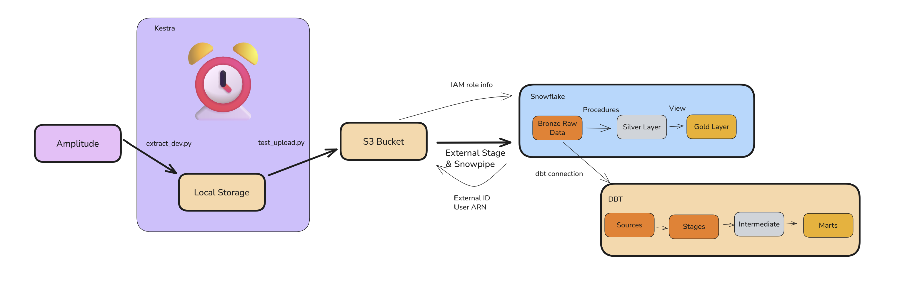

# DES 3 Amplitude Project 

This project was built following the Information Lab Data Engineering Extension Course, helping data analysts to specialise in data engineering. This repository contains python scripts used to extract data from the Amplitude API, clean the data briefly to obtain json files to be laoded into an S3 bucket.

Further processes unseen here include obtaining the data in snowflake using an external stage, following the principles of medallion architecture, json files were flattened, obtaining a first bronze layer of raw data. SQL was then used both on its own in snowflake and in dbt to obtain a silver layer with normalised data and gold layer. In snowflake, views and procedures were scheduled using tasks and streams to either run on schedule or whenever new data is fetched from Amplitude. In dbt, the code was refactored for best performance, scheduled via a job. 

Finally, overall orchestration was started in Kestra, cloning this directory within kestra to run both extraction and load script. Aiming to add the snowflake and dbt orchestration as future tasks to run the whole pipeline on a schedule. 

Here's a visual representation of the pipeline: 

Ampltidue Api Documentation: https://amplitude.com/docs/apis/analytics/export

# 1. Setting up our Environment

The first step of the project was to create our python environment, planning ahead we installed: 

requests - To use the amplitude API
python-dotenv - To load our secret variables from our .env file
boto3 - To connect to our AWS server

You can find the exact versions of what was downloaded within the requirements.txt file. 

We also assured that information that was not required on this repository was hidden using .gitignore, this includes the data, api keys and more. 

# 2. Data Extraction

Amplitude contains data from activities on our website, including information regarding the users and their interactions with different elements of the website. 

The extractions is performed and the data is held locally in a data directory, the data comes back within a data.zip file. We then extract the data from this folder, separating it in a json per hour per day. We made sure to add different steps for error handling, ensuring the connection is successful, data saved and extracted. Parameters were implemented to only obtain the last week's worth of data. 

Future modules will be implemented which would handle other errors such as json files missing for certain hours, assuring the files are not already in the s3 bucket and more. 

# 3. Data Load

We created s3 buckets and obtained the keys to connect our python script to AWS via the boto3 library. We researched the boto3 library, allowing us to identify files in the s3 bucket and push data into it. After setting up the bucket, the jsons are pushed into the bucket via a second script following from the extract script. Ideally this would be performed via modules in a single script, this has been done in the bike-point repository if you are interested in observing the difference.

# 4 Staging! 

This is where it got a bit more complicated, we wanted to connect our s3 bucket to snowflake, this meant we required the correct permissions. For this purpose we had to set up roles, users for our s3 bucket, adding permissions to the roles to create an external stage in snowflake using the role ARN from AWS. 

Once the stage was created, snowflake generated nan external user ID (user and not role!!!) which we had to implement into our permissions to link snowflake and AWS together. 

We then got to stage the data inferring the schema read from the json files we loaded, in order to obtain our raw json tables, containing a single row of json so far. 

# 5 Obtaining a Bronze Layer! 

From here we enter the tranformation part of our pipeline, it's a bit heavier and we repeated it in snowflake and dbt. 

### Snowflake 

The bronze layer was composed of the flattened data, separated between events and events lists. 

### dbt 

In dbt, we used our snowflake connection to obtain the rawe data tables, renaming the fields, keeping only the ones we were aiming to use. We also split the data into two stages, amplitude events and amplitude events lists. 

# 6 Creating the silver Layer

Here is the schema we opted for: 

### Snowflake

Within snowflake, we first built all of the tables using simple create Table as syntax. 

Here we played with different methods to schedule or maintian freshness of the data, making sure the smaller tables were set up as views to not use any storages as the computing power required to run them was quite small. For larger tables we used procedures, these were shceduled by tasks either triggered by a schedule or via a stream. We also implemented dyanic tables and snowpipes as a way to see how they function, however we opted for the schedule triggered procedures as a way to save money. The procedures were tailored to use either inset or merge, to ensure the best possible practice. 

### dbt

In dbt, we build multiple intermediate models, focusing on each of the normalised tables in the schema. This time no need to create procedure as dbt allows us to schedule jobs to run the whole lineage. We instead used our time to build thorough documentation and testing, using docblocks, new tests written in jinja, to ensure data quality remains of ther highest standard throughout our pipeline.

# 7. Gold Layer!

### Snowflake 

We created a view combining all tables, making it ready for analysis. In a real use case we would focus on the business needs and provide them with only the required data, denormalised. 

### dbt

The same view was materialised in snowflake, using our dbt_project.yml file to ensure the most oprimised materialisation strategy, below is our DAG for this project, showing our lineage from staging to our gold layer our mart.

# 8. Orkestrating a symphony!

